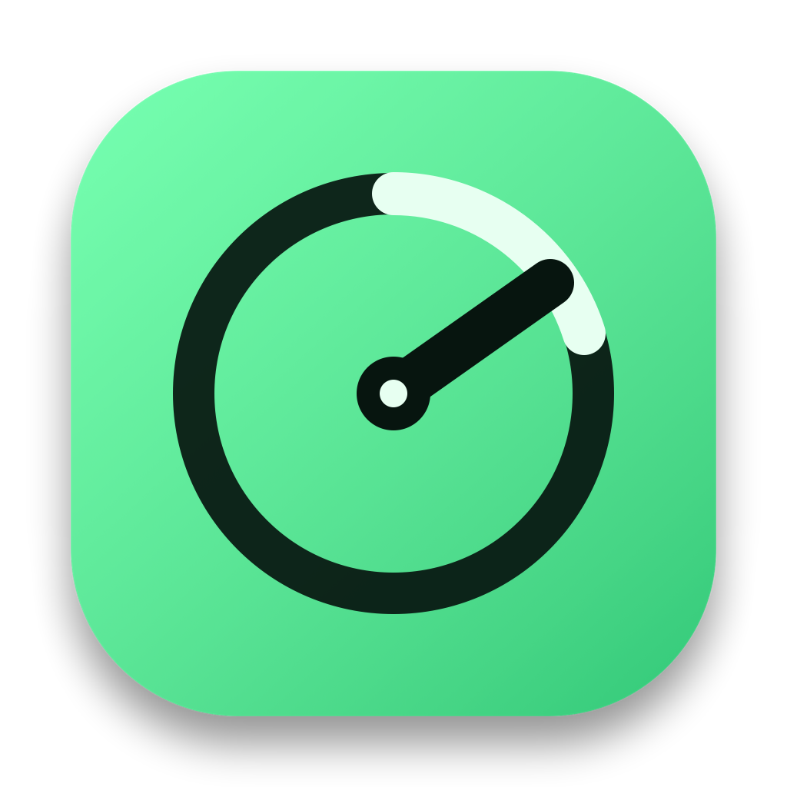
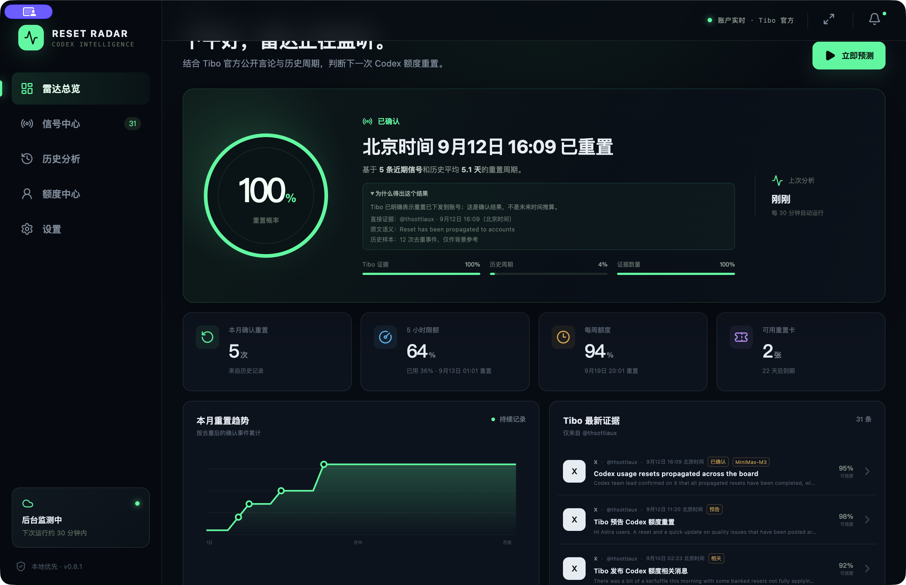
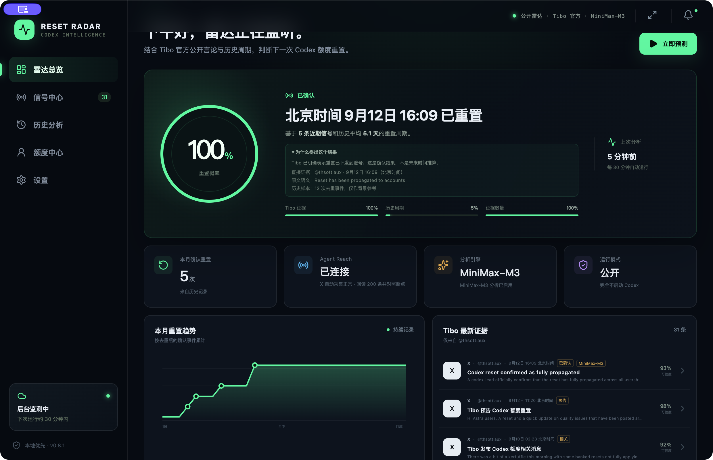
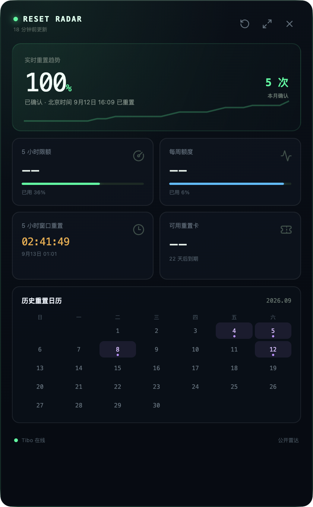
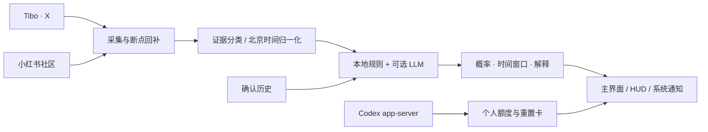

<div align="center">
  
  <h1>Codex Reset Radar</h1>
  <p><strong>把零散的重置信号，变成可解释、可追踪、会提醒的 Codex 额度雷达。</strong></p>
  <p>
    <a href="https://github.com/JesseFei87/Codex-Reset-Radar/releases/latest"></a>
    <a href="https://github.com/JesseFei87/Codex-Reset-Radar/releases"></a>
    
    
  </p>
  <p>
    <a href="https://github.com/JesseFei87/Codex-Reset-Radar/releases/download/v0.8.1/Codex-Reset-Radar-0.8.1-arm64.dmg"><strong>下载 macOS .dmg</strong></a>
    ·
    <a href="https://github.com/JesseFei87/Codex-Reset-Radar/releases/download/v0.8.1/Codex-Reset-Radar-Setup-0.8.1.exe"><strong>下载 Windows .exe</strong></a>
  </p>
</div>



## 两种运行模式

| 公开雷达模式 | 账户增强模式 |
| --- | --- |
|  |  |
| 不启动 Codex。独立完成公开信号采集、证据分析、概率预测、历史归档和通知。 | 在公开雷达之上连接官方 Codex app-server，显示真实 5 小时/周额度、自然重置时间和重置卡。 |
| 适合只关心下一次全局重置的用户。 | 适合希望同时管理个人额度和多个 Plus 账号的用户。 |

> 预测渠道也可独立选择：使用 Tibo `@thsottiaux` 的 X 官方言论作为一手证据，或使用小红书“tibo重置”多作者聚类作为社区预警。两套证据历史互不覆盖。

## HUD：把雷达留在手边

<p align="center">
  
</p>

HUD 可从系统托盘/菜单栏一键呼出，只保留重置趋势、5 小时与周额度、自然重置倒计时、可用重置卡和历史日历。开启 HUD 时主窗口自动隐藏，不打断当前工作。

## 核心能力

- **Tibo 官方信号雷达**：Agent Reach + twitter-cli 回读时间线、检查断点，并在出现历史缺口时深度回补。
- **小红书社区证据链**：OpenCLI 搜索“tibo重置”，按相近北京时间和独立发布者聚类；社区转述不会冒充官方确认。
- **可解释概率预测**：结合证据权威性、时效衰减、信号数量和历史间隔，展示概率、时间窗口与计算依据。
- **严格的历史口径**：重置日历、月度次数和趋势图只记录 Tibo 明确确认的全局重置，以及重置卡发放；个人 5 小时/周窗口不计入。
- **真实额度中心**：通过官方 Codex app-server 读取 5 小时额度、每周额度、自然重置时间和重置卡到期日。
- **双账号切换与项目接力**：支持隔离模式、共享本地项目、聊天接力和同一 Codex 退出后换号登录。
- **安全的重置卡消费**：只有用户二次确认后才调用消费接口，并使用幂等键避免重复提交。
- **后台守护**：系统托盘常驻、定时预测、高概率提醒，以及重置卡到期前通知。
- **多模型分析**：支持 MiniMax、OpenAI、Anthropic Claude、Gemini、DeepSeek、通义千问、Kimi、OpenRouter 和本机 Ollama；未配置时回退本地规则。

## 菜单功能

| 菜单 | 你可以做什么 |
| --- | --- |
| **雷达总览** | 查看当前概率、预测窗口、推导依据、本月确认次数、趋势图和最新证据。 |
| **信号中心** | 浏览 Tibo/X 或小红书证据，查看北京时间、证据类型、可信度和原文链接。 |
| **历史分析** | 查看只包含官方确认与重置卡发放的历史日历、月度统计和真实额度快照趋势。 |
| **额度中心** | 查看 5 小时/周额度、自然重置倒计时、重置卡及到期时间，并管理账号 A/B。 |
| **设置** | 切换公开/账户模式、X/小红书渠道、采集间隔、通知阈值和大模型服务商。 |
| **HUD / 托盘** | 快速查看必要指标、立即刷新、打开完整雷达、切换账号或退出应用。 |

## 工作方式



所有社交平台内容都只作为证据输入。Tibo 的明确确认可以进入重置日历；小红书社区证据只用于预警和预测，不会直接写成已确认重置。

## 下载与安装

### macOS

[下载 Codex Reset Radar 0.8.1 for macOS（Apple Silicon）](https://github.com/JesseFei87/Codex-Reset-Radar/releases/download/v0.8.1/Codex-Reset-Radar-0.8.1-arm64.dmg)

打开 DMG，将应用拖入 Applications。当前公开包未使用 Apple Developer ID 签名；首次启动如被 Gatekeeper 拦截，请在 Finder 中右键应用并选择“打开”。

### Windows

[下载 Codex Reset Radar 0.8.1 for Windows（x64）](https://github.com/JesseFei87/Codex-Reset-Radar/releases/download/v0.8.1/Codex-Reset-Radar-Setup-0.8.1.exe)

运行 NSIS 安装程序并选择安装目录。当前公开包未使用商业代码签名证书，Windows SmartScreen 可能显示未知发布者提示。

### SHA-256

```text
fba6b846c41b616533764d867a9fe38a27f673ef78e04c4459fd28703bdf0eb2  Codex-Reset-Radar-0.8.1-arm64.dmg
9f335944e7001b26775277ff416af2fa1e5cfed3c4fb790c8219d46bb88dad70  Codex-Reset-Radar-Setup-0.8.1.exe
```

## 本地开发

```bash
npm install
npm run dev
npm test
```

```bash
# 生成安装包（需准备对应平台的内置 Codex runtime）
npm run dist:mac
npm run dist:win
```

应用默认使用公开雷达模式。X 渠道依赖已配置的 Agent Reach/twitter-cli；小红书渠道通过 OpenCLI 复用用户主动登录并控制的 Chrome 会话。检测到多个 Browser Bridge Profile 时，需要在设置中选择对应 Profile。

账户增强模式不会直接解析 `~/.codex/auth.json`，而是调用官方 Codex app-server。运行时查找顺序为：ChatGPT/Codex 桌面端附带版本 → 安装包内置固定版本 → 系统 Codex CLI。

## 隐私与安全

- API Key 使用 Electron `safeStorage`（macOS Keychain / Windows DPAPI）加密，不进入渲染进程或普通状态文件。
- X 凭据由 Agent Reach 独立管理；应用不会把 Cookie 写入项目目录。
- 额度历史只保存套餐、百分比、重置时间和重置卡元数据，不保存聊天内容或认证令牌。
- 公开雷达模式完全不启动 Codex。
- 项目接力不会复制 `auth.json`，不会直接复制账号数据库，也不会覆盖原账号聊天。
- 应用绝不会自动消费重置卡；消费必须由用户明确确认。

## 说明

Codex Reset Radar 是非官方社区项目，与 OpenAI、ChatGPT、Codex、X 或小红书没有隶属关系。预测结果来自公开信号和历史统计，不代表官方承诺。

真实数据与技术边界说明见 [docs/REAL_DATA_RESEARCH.md](docs/REAL_DATA_RESEARCH.md)。
